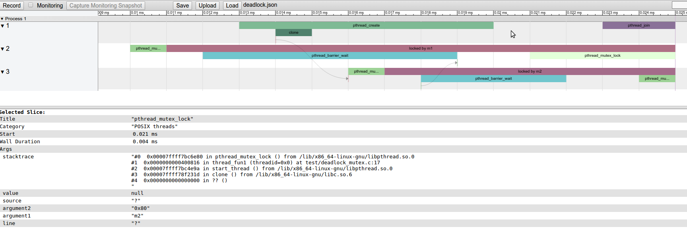

INTRODUCTION
============

Synchronization profiler ``sync-prof`` captures synchronization events
in machine code and presents them on a timeline. Synchronization
events currently include POSIX function calls and OpenMP ``gomp``
library's functions. It can also be used to trace memory accesses and
custom user functions.

Besides tracing synchronization events, ``sync-prof`` has a
synchronization model. The model analyzes traced events and emits
annotations on the timeline to assist understanding of the
concurrency. The annotations include:

- goups of related ``pthread_mutex_lock()`` and ``pthread_mutex_unlock()``
- links from ``sem_post()`` to ``sem_wait()``
- links from ``pthread_mutex_unlock()`` to blocked ``pthread_mutex_lock()``
- links among ``pthread_barrier_wait()`` calls
- links from ``clone()`` to the starting thread

The links between events often indicate inter-thread control flow.

``sync-prof`` is handy for:

- visualization of concurrency (issues)
- visual analysis of data race
- visual analysis of inconsistent lock
- visual analysis of deadlocks and livelocks
- performance debugging of concurrent software

SYSTEM REQUIREMENTS
===================

``sync-prof`` was tested with:

- 64-bit Intel processors
- Ubuntu 12.04 and newer
- gdb 7.8 or newer
- (optional) Google Chrome 38 or newer to visualize the graphical timeline

On Ubuntu 18.04 make sure to install::

  $ sudo apt install gcc python-pytest

USAGE
=====

Just provide the executable as a command line argument to ``sync-prof``::

  $ gcc -g hello.c -o ./a.out
  $ sync-prof ./a.out

``sync-prof`` will generate sp.txt with textual representation of the
traced synchronization points. The graphical timeline view can be
studied in the Chrome browser. Run ``sync-prof`` with the ``-f chrome``
command line option, then open ``chrome://tracing`` in the Chrome
browser and load the generated ``sp.txt`` using the Load button.

Run with ``-h`` to get more help on usage and command line arguments.

The textual output contains a basic synchronization timeline with time
growing downwards in the text. Each column represents a separate
thread. Each event is denoted by its function call and the content of
the first function argument. Vertical lines under the first charater of
an event depict the waiting time. Nested events are shifted right.
Consider the example below::

  pthread_create pthread1
  ├─clone 0xabcdabcd
  │ │
  │
  
  pthread_mutex_lock m1
                                 pthread_mutex_lock m1
  pthread_mutex_unlock m1        │
                                 │
  
                                 pthread_mutex_unlock m1

This example timeline describes a parallel program with two threads.
The first thread creates the second one, which, subsequently, locks
mutex ``m1``. The ``clone`` event occurs during ``pthread_create``
event. The ``pthread_mutex_lock(m1)`` waits two synchronization
steps. Note, that the second thread's ``pthread_mutex_lock(m1)`` has
to wait until the first thread unlocks it.

The graphical timeline in Chrome contains more information per event,
as well as annotations generated by the built-in concurrency model.
Below is an example screenshot of the Chrome tracing tool visualizing
the timeline with synchronization points:

STATUS
======

``sync-prof`` is not a mature tool yet:

1. the internal tests fail on Ubuntu 18.04,
2. not tested on larger programs with complex relocations
   and large code segments.

Here is a list of TODOs and notes:

- GOAL: visualize the deadlock in Postit and identify the root cause.
  Disable deep analysis to workaround the crash?
  ERROR: Event pthread_spin_init 0x62dd10 must be the last element of threadEvents
- FEATURE: configuration file with per event specification of the opaque
  property
- BUG: pthread_create should be non-opaque to trigger clone and links
  related to that.
- BUG: fix sync-prof crash when doing deep analysis of Postit
- BUG: pthread_cond_signal and _broadcast should not generate flow links to
  future cond_wait. So, only if the end of cond_signal is after the
  start of the cond_wait, then the link should trigger!
- use symbols ├ ─ │ to print text output, which will clarify the nesting
  relations between events.
- GOAL: visualize pthread_mixes with many threads spawned
- add options --trace-access VARIABLE and --trace-function FUNCTION
- visualize the race at the very end of the POSTIT warned about by TSAN
- pthread_mutex_trylock() should emit a 'locked by' block only if it returns
  0.
- semaphore values are not tracked. Hence, two sem_post() can link to the
  same sem_wait(). This is imprecise and confusing.
- OpenMP support:
  - link gomp_parallel_start() and gomp_parallel_end()
- C11 and C++11 support
- gdb 7.4 also does not trigger FinishBreakpoints() even on smoke_posix_test.c
- fix the nesting issue triggered by Postit. Then make a switch to make
  default breakpoints opaque. Alternatively, make a configuration file, which
  can specify what breakpoints to be opaque. In Postit tasks are called from
  default breakpointed (?) functions, which hides the tasks in the view.
  parallel3 (Postit app) has libavcodec, which has weird locks. First,
  lock(foo) is called, than while it's executing, another version of lock(foo)
  is called. One version is form libc the other is from pthread libraries.
  FinishBreakpoint for the first lock() is triggered first, so sync-prof
  asserts complaining about non-nested execution of traced functions.
  Implement support for such non-nested events by adapting data structures.
  For now, only support nesting of user-defined functions and other functions
  are not traced internally.
- In pthread.c sometimes the shared_var is accessed (or just printed by sync-prof)
  only once!? That is wrong! It is read, updated, then written into.
- add --output=- to dump output (e.g. text) to stdout (or stderr, which does
  not buffer).
- add recursive function test (~/src/recurs_nested.cpp = mutually recursive)
- replace asserts with a clean SPError(msg), including a Python stacktrace
- Python debugger gdb support using option debug (no misses stdout from PDB!?)
- Refactor SP to put controller code including the invocation of gdb into a single
  module. In other words, get rid of GDB specific code from sync-prof.
  Generalize parts of sp_gdb_ctrl.py into a generic debugger setup script that
  configures the model, debugger controller, and the viewer and connects them
  together.
- pretty printing options:
  - text output: include thread start markers (via self.View.mark(scope='thread')
  - raw text links (markers) between syncs ("--->")
  - HTML with source links, inter-sync hyperlinks and arrows
- sync.conf and --command can be unified to enable various analysis depth.
  For example, the user can specify omp.sync as an option or his own file
  to analyze a particular program.
- support attaching to process for partial profiling
- add proper logging
- GDB Python's pretty printer to wipe out the unwanted stderr messages from GDB:
  .*63\.\.\/nptl\/pthread_mutex_lock\.c\: No such file or directory\.
  Function "GOMP_single_start" not defined\.
- get up & running on other platforms (ARM, Mac?)
- check subclasses do not override by mistake some base class variables
  or use a name prefix.
- (automated?) pylint checking as part of tests
- in machine interface of gdb I see old and new values printed, which the
  interactive mode misses now.
  The number of access watchpoints is also correct :-( While in Python
  API I cannot find the way to find values and even read/write.
  How to figure out if it is a READ or WRTE? I can create two breakpoints per variables
  (read and write).
- speedup profiling. It takes about 10x longer than native execution.
- add wall-clock timing to the timeline by measuring delays between breakpoints. 
- tracepoints can be faster than breakpoints
- potentially useful for many things
  - synchronization issues analysis (globally long-held lock, too few locks)
- timing is useful
- name threads in text
- "of parallel program"
- systemtap as the engine?
- http://lttng.org/ LttNG has a visualization tool, good match with sync-prof?
- gdb 7.7 is too new
- text was unreadable
- use meaningful defaults (few are interested in events under pthread*- and GOMP_*
- study hellgrind error messages, visualize them if they are true positives.
- The issue with finish GDB command is that if it  is interrupted by another
  breakpoint, then the finish is abandoned and the commands after finish start
  running! Looks like no nesting is supported for command sequencies. If not
  interrupted, the commands with finish works fine. Solution: Python
  gdb.Breakpoint().
